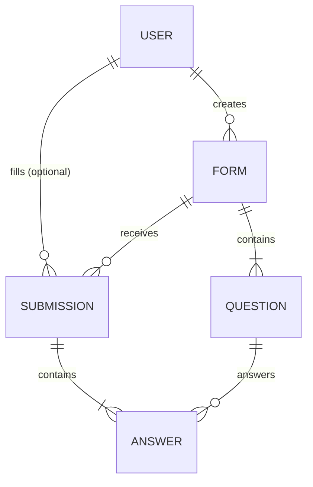
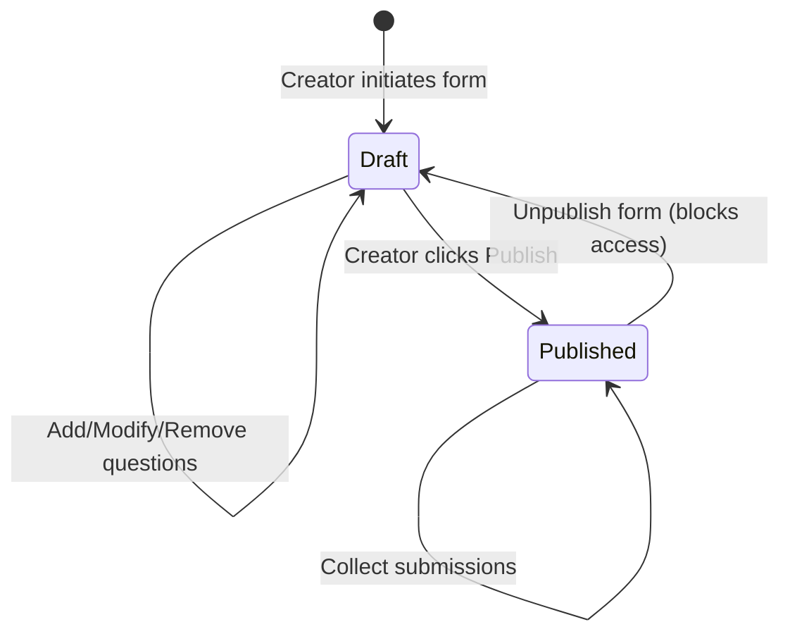

# Data Model: Full-Stack Form Builder and Filling Application

This document describes the relational database schema, fields, relationships, and validation rules stored in PostgreSQL.

---

## Entity Relationship Diagram (Conceptual)

---

## Entities & Tables

### 1. `users` Table
Stores authentication details and profiles of registered creators and responders.

| Column | Type | Constraints | Description |
|---|---|---|---|
| `id` | Integer | PRIMARY KEY, SERIAL | Auto-incrementing identifier |
| `email` | String(120) | UNIQUE, NOT NULL | Registration email address |
| `password_hash` | String(128) | NOT NULL | Securely hashed password (bcrypt) |
| `full_name` | String(100) | NOT NULL | Full name of the user |
| `created_at` | Timestamp | DEFAULT now() | Account creation timestamp |

---

### 2. `forms` Table
Represents forms created by registered users.

| Column | Type | Constraints | Description |
|---|---|---|---|
| `id` | UUID | PRIMARY KEY, DEFAULT uuid_generate_v4() | Obfuscated public and internal identifier |
| `creator_id` | Integer | FOREIGN KEY (`users.id`), NOT NULL | Reference to the form creator |
| `title` | String(200) | NOT NULL | Title of the form |
| `description` | Text | NULL | Description of the form's purpose |
| `is_published` | Boolean | DEFAULT false | Flag to toggle public filling capability |
| `created_at` | Timestamp | DEFAULT now() | Form creation timestamp |

---

### 3. `questions` Table
Represents structural items inside a form.

| Column | Type | Constraints | Description |
|---|---|---|---|
| `id` | Integer | PRIMARY KEY, SERIAL | Auto-incrementing identifier |
| `form_id` | UUID | FOREIGN KEY (`forms.id`), NOT NULL | Reference to the associated form |
| `question_text` | Text | NOT NULL | The query asked to responders |
| `question_type` | String(30) | NOT NULL | `text`, `checkbox`, or `radio` |
| `options` | JSON | NULL | Array of choice strings, e.g., `["Yes", "No"]` |
| `is_required` | Boolean | DEFAULT false | Mandatory flag for responders |
| `order_index` | Integer | NOT NULL | Order sequence number in the form UI |

**Validation Rules**:
*   `question_type` must be one of: `text`, `checkbox`, `radio`.
*   If `question_type` is `checkbox` or `radio`, `options` must be a JSON array containing at least one choice.

---

### 4. `submissions` Table
Represents a filling event of a form.

| Column | Type | Constraints | Description |
|---|---|---|---|
| `id` | Integer | PRIMARY KEY, SERIAL | Auto-incrementing identifier |
| `form_id` | UUID | FOREIGN KEY (`forms.id`), NOT NULL | Reference to the filled form |
| `user_id` | Integer | FOREIGN KEY (`users.id`), NULL | Optional reference if responder is logged in |
| `responder_name` | String(100) | NOT NULL | Name provided during filling |
| `responder_email` | String(120) | NOT NULL | Email provided during filling |
| `submitted_at` | Timestamp | DEFAULT now() | Time of submission |

---

### 5. `answers` Table
Represents responses to specific questions inside a submission.

| Column | Type | Constraints | Description |
|---|---|---|---|
| `id` | Integer | PRIMARY KEY, SERIAL | Auto-incrementing identifier |
| `submission_id` | Integer | FOREIGN KEY (`submissions.id`), NOT NULL | Reference to the parent submission |
| `question_id` | Integer | FOREIGN KEY (`questions.id`), NOT NULL | Reference to the answered question |
| `value` | JSON | NOT NULL | The responder's choice(s). E.g., `{"text": "John"}` or `{"checked": ["Option A", "Option C"]}` or `{"selected": "Option B"}` |

---

## State Transitions & Validation

1.  **Creation Validation**:
    *   Form must have a valid title.
    *   No questions can have empty question texts.
    *   Multiple-choice questions (radio/checkbox) must have options defined.
2.  **Submission Validation**:
    *   Forms must be in a `Published` state (`is_published = true`) to accept answers.
    *   For each question with `is_required = true`, the submission must contain a non-empty answer.
    *   Answers to `radio` questions must be exactly one of the options defined in the question options JSON.
    *   Answers to `checkbox` questions must contain options matching the choices in the question options JSON.
